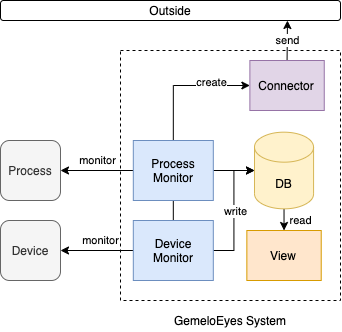
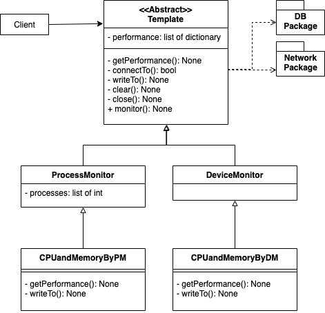

# psMonitor
The project for performance monitor. Currently that's only CPU and Memory monitor for sample.
> In the future it will be modified the name-- **GemeloEyes**

> Now just only **DeviceMonitor** can run, then **ProcessMonitor** is still repaired.

Understand what DeviceMonitor and ProcessMonitor are, please go to [Design Blueprint](#design-blueprint)

Lastest Update: 2021-10-25

## !!Notice
Flask controller services are some problems...

## Prerequisite
In this project that used:
* Docker 20.10.8
* Python 3.7.0+

## Getting Started
### Setup
* `.env` file:
    ```
    # some databases need to config
    DB_HOST=[The host name of DB]
    DB_PORT=[The port of DB]
    DB_USER=[The username of DB] (Optional)
    DB_PASSWORD=[The password of DB] (Optional)
    ```
* install the dependency packages by command:
    * `pip install -r requirements.txt`

* If you want to install docker in raspberry pi, please use the shell script in `docker` directory:
    * `bash docker-install.sh`

### Start
* You want to run program by yourself. Please follow the steps:
    1. Go to the `docker` directory and run this command:
        * `docker build -t sqlite3 -f sqlite_dockerfile .` to build sqlite dockerfile for operating sqlite database
    2. Go to the `psMonitor` directory and run the python program:
        * `python main.py`

### Stop
1. You can use `ctrl+c` to terminate the process.

## Code Template for custom
* The code constructs by template pattern:
    ```python
    import sys
    print(sys.path)

    from templates.deviceMonitor.CPUandMemoryForDM import CPUandMemoryForDM
    import os
    import time

    from dotenv import load_dotenv
    from logger.logger import Logger
    logger = Logger.instance()

    if __name__=='__main__':
        """ Entry point """
        load_dotenv()
        logger.info('Load environment variables successfully.')
        cpuAndMemDM = CPUandMemoryForDM()
        while True:
            cpuAndMemDM.monitor()
    ```
* The code is for flask services
    ```python
    app = Flask(__name__)
    app.register_blueprint(paramModule)

    def running_server():
        logger.info('server is running...')
        app.run(host="0.0.0.0", port=3000)

    @app.route('/', methods=['GET'])
    def hello_world():
        """
        Testing the web server is running
        :return: message of running web server
        """
        return "Web server is running"
    ```
    * Using the thread to avoid blocking, you don't modify it.
        `threading.Thread(target=running_server, daemon=True).start()`
    * If you want to change your monitor parameter for each agent, please register your agent:
        `MonitorAgents.registerSingle(([string: name], [template: yourTemplateAgent]))`
* Step of writing code:
    1. Use the monitor template, you can design what the template of monitor you want by yourself
        * `ps = YourselfMonitorTemplate(args...)` is your monitor template. 
        * Just extends the `DeviceMonitor` in `psMonitor/templates/deviceMonitor` directory to implement the template the you want.
    2. Remember to put `monitor` method in loop.
        * `ps.monitor()` in `while loop` or `for loop`.
        * You can use `time.sleep([secs])` to control the monitor frequency.
        * You can take `threading` package to implement multiple agents running.

### Support Third-Parties
#### Database
* [sqlite](https://sqlite.org/index.html)
#### Network Protocol
* [mqtt](https://mosquitto.org/)


## Test
* `.env_test` file:
    ```
    # some databases need to config
    DB_HOST=[The host name of DB]
    DB_PORT=[The port of DB]
    DB_USER=[The username of DB]
    DB_PASSWORD=[The password of DB]
    ```

* The following is test cases:
    * Test that get system performance.
    * Test that writes data that monitored into database.
    * Test the whole monitor mechanism (code in template method) on running.  
* If you would like to test MQTT, please goto `docker` directory and run this command:
    `bash mqtt_docker.sh`

## Design Blueprint
### System Design
> Later will modify the system and code design

The system design of psMonitor:



### Code Design
The code design of psMonitor:



### File Structure
> Later will modifiy file structure

```
├── docker
├── docs
├── psMonitor
│   ├── __pycache__
│   ├── exceptions
│   │   └── __pycache__
│   ├── logger
│   │   └── __pycache__
│   └── templates
│       ├── __pycache__
│       ├── deviceMonitor
│       └── processMonitor
└── tests
```

## Contribution
* Hao-Ying Cheng (MaskerTim)
    * Email: t109598001@ntut.org.tw
    * Affliation: National Taipei University of Technology