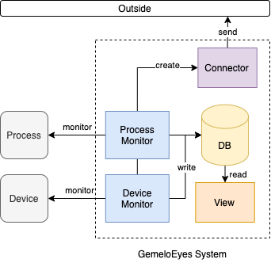
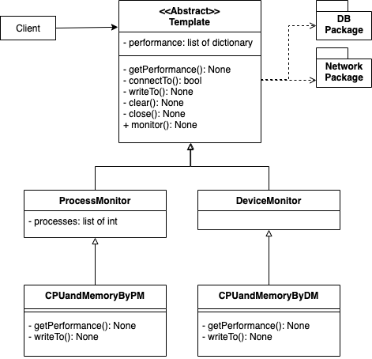

# GemeloEyes
The project for performance monitor. Currently that's only CPU and Memory monitor for sample.

> Now just only **DeviceMonitor** can run, then **ProcessMonitor** is still repaired.

Understand what DeviceMonitor and ProcessMonitor are, please go to [Design Blueprint](#design-blueprint)

Lastest Update: 2021-10-31

## Prerequisite
In this project that used:
* Docker 20.10.8
* Python 3.7.0+

## Getting Started
### Setup
* install the dependency packages by command:
    * `pip install -r requirements.txt`

* If you want to install docker in raspberry pi, please use the shell script in `docker` directory:
    * `bash docker-install.sh`

### Start
* You want to run program by yourself. Please follow the steps:
    1. Go to the `docker` directory and run this command:
        * `docker build -t sqlite3 -f sqlite_dockerfile .` to build sqlite dockerfile for monitoring whether sqlite database is running normally or not
    2. Go to the `psMonitor` directory and run the python program (need to check you are using command `python3` or `python`):
        * `python main.py`

### Stop
* Terminate the process by using `ctrl+c` to terminate the process.
* Terminate the docker container by `docker-compose down` after going to `docker` directory.

## Code Template for custom
* The code constructs by template pattern:
    ```python
    import sys
    print(sys.path)

    from templates.deviceMonitor.CPUandMemoryForDM import CPUandMemoryForDM
    import os
    import time

    from dotenv import load_dotenv
    from logger.logger import Logger
    logger = Logger.instance()

    if __name__=='__main__':
        """ Entry point """
        load_dotenv()
        logger.info('Load environment variables successfully.')
        """ Monitor and write into Database """
        # Create a database handler
        dbHandler = DBFactory.createInstance('sqlite3', dbName='performance.db')
        # Create a monitor agent with database or network handler
        cpuAndMemDM = CPUandMemoryForDM(handler=dbHandler)
        
        # Register agent to listener
        MonitorAgents.registerSingle(('test', cpuAndMemDM))
        
        # Start monitoring
        while True:
            cpuAndMemDM.monitor()
    ```
* The code is for flask services
    ```python
    app = Flask(__name__)
    app.register_blueprint(paramModule)

    def running_server():
        logger.info('server is running...')
        app.run(host="0.0.0.0", port=3000)

    @app.route('/', methods=['GET'])
    def hello_world():
        """
        Testing the web server is running
        :return: message of running web server
        """
        return "Web server is running"

    if __name__=='__main__':
        # run flask server for listening
        threading.Thread(target=running_server, daemon=True).start()
    ```
    * the thread is to avoid blocking, you don't modify it.
        `threading.Thread(target=running_server, daemon=True).start()`
    * If you want to change your monitor parameter for each agent, please register your agent:
        `MonitorAgents.registerSingle(([string: name], [template: yourTemplateAgent]))`
* Control the parameters of a monitor agent, please using `Postman` to post your request by service url.
    * For instance, control the interval of monitor, please post this url: `http://[your agent ip]:[the service port]/changeInterval/[your agent name]/interval/[the interval seconds]`
    * If want to know other services, please go to `psMonitor/controller` directory. There are lots of service provided by Flask web server. 
* Step of writing code:
    1. Use the monitor template, you can design what the template of monitor you want by yourself
        * `ps = YourMonitorTemplate(args...)` is your monitor template. 
        * Just extends the `DeviceMonitor` in `psMonitor/templates/deviceMonitor` directory to implement the template the you want.
    2. Remember to put `monitor` method in loop.
        * `ps.monitor()` in `while loop` or `for loop`.
        * You can use `time.sleep([secs])` to control the monitor frequency.
        * You can take `threading` package to implement multiple agents running.

### Support Third-Parties
#### Database
* [sqlite](https://sqlite.org/index.html)
#### Network Protocol
* [mqtt](https://mosquitto.org/)


## Test
* The following is test cases:
    * Test that get system performance.
    * Test that writes data that monitored into database.
    * Test the whole monitor mechanism (code in template method) on running.
    * Test write to database successfully
    * Test send out to network successfully  
* If you would like to test MQTT, please goto `docker` directory and run this command to start mqtt broker: `bash mqtt_docker.sh`
    * `mqtt_conf` is a directory for configuration of mosquitto, you could refer to its [official website](https://mosquitto.org/). Also, you could refer to [official docker hub](https://hub.docker.com/_/eclipse-mosquitto) for mosquitto of docker version.
* If you would like to test it could run successfully, please test by `test_main.py` in `tests` directory. Just run `python3 tests/test_main.py`.

## Design Blueprint
### System Design
> Later will modify the system and code design

The system design of psMonitor:



### Code Design
The code design of psMonitor:



### File Structure
```
├── docker
│   └── mqtt_conf
│       ├── mosquitto_data
│       └── mosquitto_log
├── docs
├── psMonitor
│   ├── controller
│   ├── exceptions
│   ├── factory
│   │   ├── database
│   │   └── network
│   ├── logger
│   └── templates
│       ├── deviceMonitor
│       └── processMonitor
└── tests

```

## Conclusion
If any questions, please contact me by email or post a issue on github.

## Contribution
* Hao-Ying Cheng (MaskerTim)
    * Email: t109598001@ntut.org.tw
    * Affliation: National Taipei University of Technology